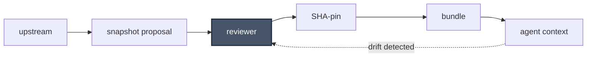

# skill-engine

> Teach Claude your codebase. Keep it taught.

[](https://github.com/nick-railsback/skill-engine/actions/workflows/lint.yml) [](https://github.com/nick-railsback/skill-engine/releases) [](./LICENSE) [](https://github.com/nick-railsback/skill-engine/blob/main/.github/workflows/security.yml)

skill-engine turns the repos and docs of your given domain area into a Claude a skill
you can use elsewhere — registering each source in `source-paths.json`,
cloning it to `~/.cache/skill-engine/` on your confirmation, and generating a
contextualizer skill that loads its index on demand.

> Anthropic's skill spec existed, but my work didn't fit it — many repos, conflicting conventions across teams, a moving target I couldn't maintain by hand. Anthropic described the destination; I needed the road.
>
> I built a prototype first for daily feature development, then to spot efficiency opportunities across the ecosystem, then once to rescue a 20-year-old application on a one-month deadline when the original builders were gone.
>
> Each use surfaced the next gap the spec hadn't addressed: drift detection, multi-source synthesis, reviewer gates, evaluation. Each gap is now closed.

**Same question. Two different realities.**

```
You: What's the convention for adding a new API endpoint here?

Claude: In most frameworks you'd register a route on the app object —
        Flask uses @app.route, FastAPI uses @router.get, Express uses
        app.get(). Check your framework's docs for middleware patterns.
```

```
You: What's the convention for adding a new API endpoint here?

Claude: Use register_route() in src/api/routing.py — that's the single
        entrypoint. The gateway middleware at src/api/gateway.py:42
        injects correlation IDs for every request, so bare @app.route
        decorators will silently skip tracing.
```

**→ [Get started in 2 minutes](#quickstart)**

## What this is

Anthropic publishes [a spec](https://resources.anthropic.com/hubfs/The-Complete-Guide-to-Building-Skill-for-Claude.pdf) for giving Claude reusable
skills — directories of markdown files Claude reads on demand. Skill-engine is the
operational infrastructure that makes that spec production-grade for real codebases:
multi-source synthesis, drift detection, reviewer gates, and a self-auditing eval
layer the spec never had to provide.

If pip is to PEPs what Kubernetes is to container primitives — skill-engine is that
layer for Anthropic's skill-directory pattern.

## The load-bearing capability

Multi-source synthesis. Register N sources — git repositories, external docs,
local paths, a giant monorepo — and skill-engine emits a single navigator skill
that reasons across all of them. When Claude answers a question that touches
four sources at once, it holds the tensions between them: the older intent,
the newer correction, the constraint that overrides both.

Not because it works on any single source. Because it holds across all of them.

## What else is in the box

Multi-source synthesis was one of several gaps the spec left for an operator to
close. Each feature below is something Anthropic's published Agent Skills spec
does not ship.

**[Drift detection + REFRESH](./CAPABILITIES.md#how-it-stays-accurate).** Every source is pinned to its content hash at
ingest time. When upstream shifts, skill-engine notices and proposes updated
references for review. Your contextualizer never silently goes stale.

**[Goal-given DISCOVER](./CAPABILITIES.md#how-it-gets-built).** State what you're trying to do; the engine reads your
sources, decides what matters, and emits the references — validating its own
output against four invariants before surfacing it. Autonomous skill construction
with guardrails.

**[SELF-AUDIT](./CAPABILITIES.md#how-it-knows-its-still-right).** Five drift checks the skill runs against itself: stale dates,
broken URLs, long-untouched references, catalog-vs-content divergence,
cross-reference accuracy. The skill audits itself; you review the findings.

**[Reviewer-in-the-loop (by default)](./CAPABILITIES.md#how-human-review-fits).** The engine surfaces every proposed
change for review before applying it. The contents of a contextualizer become
Claude's source of truth for an entire domain — silent propagation of wrong
content is a worse failure than five minutes of review. Review-first is the
default; future versions may add opt-in autonomy flags for low-risk operations.

**[source-paths.json — a schema, not a config file](./CAPABILITIES.md#how-it-gets-built).** Four first-class source
kinds (`git-managed`, `external-doc`, `web-doc` (documentation sites crawled
via WebFetch / MCP fetch), `local-path`) with a machine-readable schema other
tools can conform to. The schema is the contract.

[**→ Full capabilities reference**](./CAPABILITIES.md)

## See it in practice

The legacy-rescue story is one shape skill-engine takes. Here are others.

- **[The Senior Engineer Rescuing a Legacy Application](./docs/personas/legacy-rescue.md)** —
  A 20-year-old codebase, a one-month deadline, no original builders. The
  founding-myth case.
- **[The Forward-Deployed Engineer](./docs/personas/forward-deployed-engineer.md)** —
  Answers wrong in a customer call. Reclaims credibility and never gets
  blindsided again.
- **[The Newly-Hired Engineer](./docs/personas/new-hire-engineer.md)** —
  Drops into an enterprise SaaS codebase with a 6-12 month onboarding tradition.
  Becomes a leading contributor in his first sprints.
- **[The Solutions Engineer](./docs/personas/solutions-engineer.md)** — Evaluates
  five competing agentic-payments protocols by spinning up one contextualizer
  per protocol and composing them against his business context.
- **[The Senior Product Manager](./docs/personas/senior-product-manager.md)** —
  Technical-adjacent, not a coder. Composes her predecessor's strategy memos
  with the live platform monorepo to surface where intent and reality have
  drifted — before championing the next roadmap.

Not your situation? [Open an issue](https://github.com/nick-railsback/skill-engine/issues)
describing how you'd want to use it.

## Where this is in its life

This is v0.2.1. There is one worked example, one maintainer who built it because
he needed it and it did not yet exist.

If you've ever stood in front of a codebase that outlived its authors, or
handed a junior engineer documentation you couldn't vouch for, you already
understand what this is for. The rest is just building.

## Safety Model

Skill-engine treats one failure as worse than all others: silent propagation
of wrong content into a contextualizer that then becomes Claude's source of
truth for an entire domain. When a snapshot drifts from upstream, or an
upstream change carries a subtle regression, downstream users inherit the
corruption without noticing. By the time it surfaces — Claude confidently
citing a stale invariant, a removed file, a contradicted convention — the
loss is no longer local. Five minutes of review beats five weeks of
debugging Claude's wrong answers.

Every upstream change enters as a proposal, never an auto-merge. The reviewer
is the gate: a snapshot is only promoted to the bundle once a human has
compared the proposed change against the version it replaces. Each accepted
snapshot records the upstream commit SHA it was reviewed against, so the
bundle carries its own provenance. When upstream moves past a pinned
snapshot, drift surfaces loudly rather than silently — and surfaces back
through the reviewer, not around them. The engine never mutates git state on
the user's behalf. Reviewer-in-the-loop is not a setting; it is the only mode.



- **Lint** — ≥80% of load-bearing paragraphs carry a permalink within 5 lines.
- **SHA-pinning** — every snapshot records the commit it was reviewed against.
- **Drift surfacing** — stale snapshots fail loudly, not silently.

> **Quote the line, or name its absence.**

*skill-engine will never ship an auto-accept mode. If you want one, fork.*

See [`SECURITY.md`](./SECURITY.md) for vulnerability reporting and supported versions.

## Quickstart

```
/plugin marketplace add nick-railsback/skill-engine
/plugin install skill-engine@skill-engine-marketplace
/skill-engine:engine-bootstrap https://github.com/<your-org>/<your-repo>
/skill-engine:discover
```

Twenty minutes from a fresh Claude Code session to a working contextualizer.
[Full quickstart →](./plugin/skill-engine/docs/quickstart.md)

## Doctrine and dependencies

Skill-engine sits in the category I'd call **Skill Infrastructure** — operational
tooling on top of Anthropic's published Agent Skills spec. The full doctrine
lives in [docs/doctrine.md](./plugin/skill-engine/docs/doctrine.md).

Dependencies: bash, git, `jq`. No Node, no npm, no scheduler. The default
cadence is manual; reviewer-in-the-loop is the default operating mode. Both
defaults are deliberate — and revisable as the project matures.

## FAQ

<!-- Batch 8/9: most-asked operational question goes here, above the safety-model entry. -->

> **Q: Why reviewer-in-the-loop instead of auto-merge for snapshot updates?**
>
> A: Auto-merge is faster. That is the honest comparison, and it's where
> I'll start. The trade is different: when a snapshot moves into a contextualizer,
> it becomes Claude's source of truth for an entire domain. A corrupted
> snapshot doesn't fail loudly — it propagates. Claude cites the wrong
> invariant. A team inherits the corruption silently, and by the time a user
> catches the contradiction, every downstream answer rooted in that snapshot
> is suspect. The cost of review is roughly five minutes per snapshot
> update. The cost of a silent bad snapshot can run for weeks before someone
> notices the pattern, and the cleanup touches every conversation that
> referenced the corrupted region. The Mermaid flow above is deliberate:
> drift detection re-enters the loop through the reviewer, not around.
> Surfacing drift is itself a reviewable event, not a background patch.
> Future versions may add opt-in autonomy flags for low-risk operations —
> log rotation, cache eviction, telemetry. Auto-merge for snapshot content
> is not on the roadmap for the v0.x line, and a fork that wires it in
> would be welcome but explicitly unsupported.
