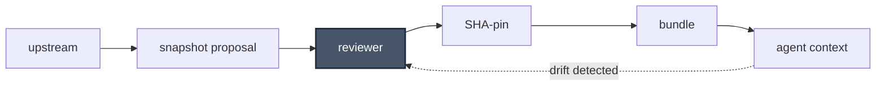

# skill-engine

> Teach Claude your codebase. Keep it taught.

[](https://github.com/nick-railsback/skill-engine/actions/workflows/lint.yml) [](https://github.com/nick-railsback/skill-engine/actions/workflows/hooks-audit.yml) [](https://github.com/nick-railsback/skill-engine/releases) [](./LICENSE) [](https://github.com/nick-railsback/skill-engine/blob/main/.github/workflows/security.yml)

skill-engine turns the repos and docs of your given domain area into a Claude skill
you can use elsewhere — registering each source in `source-paths.json`,
cloning it to `~/.cache/skill-engine/` on your confirmation, and generating a
contextualizer skill that loads its index on demand.

> Anthropic's skill spec existed, but my work didn't fit it — many repos, conflicting conventions across teams, a moving target I couldn't maintain by hand. Anthropic described the destination; I needed the road.
>
> I built a domain-specific prototype first, inside one company, for its codebase. It earned its keep there — daily feature work for the company's engineers and a few PMs across the ecosystem, then a one-month rescue of a twenty-year-old application whose original builders were gone.
>
> Then the turn: the *method* generalized even though the bespoke tool didn't. So I built this general, plug-and-play repo independently from the same ideas.
>
> Each use surfaced the next gap the spec hadn't addressed: drift detection, multi-source synthesis, reviewer gates, evaluation, coverage testing. Each gap is addressed in the engine that follows.

**What you get.** From your registered sources, skill-engine emits one
*contextualizer* skill: a navigator that routes each question to the right
reference files, every reference pinned to the source commit it was drawn from.
Claude loads the index on demand and answers from that corpus — citing the file
and SHA behind each load-bearing claim.

```
You: /langchain-context How do I require human approval before a tool runs?

Claude: Add the built-in human_in_the_loop middleware to
        create_agent(middleware=[...]). It declares the pause; the actual
        pause/resume is LangGraph's interrupt mechanism, so it needs a
        checkpointer to be durable and a thread_id to resume.
        (human_in_the_loop.py, factory.py; langgraph/types.py)

        References consulted: langchain-v1-agents.md, langgraph-overview.md.
        Grounded in langchain@v1 (SHA 7bb4130) + langgraph@1.2.2 (SHA add2696).
```

*A real answer from the bundled [`langchain-context`](examples/langchain-context)
example — each load-bearing claim cites the source file and the commit it was
pinned at. A web-enabled frontier model answers this correctly too; the
contextualizer's edge is **auditable grounding in one local read** — no per-query
web fetch, every claim traceable to a reviewed snapshot at a fixed commit. That
matters most where web search can't help anyway: **private code, internal docs,
and air-gapped or cost-controlled deployments.***

**→ [Quickstart — a working contextualizer in ~20 min](#quickstart)**

## What this is

Anthropic publishes [a spec](https://resources.anthropic.com/hubfs/The-Complete-Guide-to-Building-Skill-for-Claude.pdf) for giving Claude reusable
skills — directories of markdown files Claude reads on demand. Skill-engine is the
operational infrastructure that extends that spec for real, multi-repo codebases:
multi-source synthesis, drift detection, reviewer gates, and a self-audit
layer (drift checks plus grounded-rate and permalink-density metrics) the
spec never had to provide.

If pip is the operational layer on top of Python's packaging PEPs, skill-engine
is that layer for Anthropic's skill-directory pattern.

## The load-bearing capability

Multi-source synthesis. Register N sources — git repositories, external docs,
local paths, a giant monorepo — and skill-engine emits a single navigator skill
that reasons across all of them. When Claude answers a question that touches
four sources at once, it holds the tensions between them: the older intent,
the newer correction, the constraint that overrides both.

Not because it works on any single source. Because it holds across all of them.

## What else is in the box

Multi-source synthesis was one of several gaps the spec left for an operator to
close. Each feature below is something Anthropic's published Agent Skills spec
does not ship.

**[Drift detection + REFRESH](./CAPABILITIES.md#how-it-stays-accurate).** Every source is pinned to its content hash at
ingest time. When upstream shifts, skill-engine notices and proposes updated
references for review. Your contextualizer never silently goes stale.

**[Goal-given DISCOVER](./CAPABILITIES.md#how-it-gets-built).** State what you're trying to do; the engine reads your
sources, decides what matters, and emits the references — validating its own
output against four invariants before surfacing it. Autonomous skill construction
with guardrails.

**[SELF-AUDIT](./CAPABILITIES.md#how-it-knows-its-still-right).** Eight drift checks the skill runs against itself: stale dates,
broken URLs, long-untouched references, catalog-vs-content divergence,
cross-reference accuracy, review-state staleness, paragraph→permalink
density, grounded-citation rate. The skill audits itself; you review the
findings.

**[Reviewer-in-the-loop (by default)](./CAPABILITIES.md#how-human-review-fits).** The engine surfaces every proposed
change for review before applying it. The contents of a contextualizer become
Claude's source of truth for an entire domain — silent propagation of wrong
content is a worse failure than five minutes of review. Review-first is the
default; future versions may add opt-in autonomy flags for low-risk operations.

**[source-paths.json — a schema, not a config file](./CAPABILITIES.md#how-it-gets-built).** Four first-class source
kinds (`git-managed`, `external-doc`, `web-doc` (documentation sites crawled
via WebFetch / MCP fetch), `local-path`) with a machine-readable
[JSON Schema](plugin/skill-engine/engine-bootstrap-templates/source-paths.schema.json)
other tools can validate against — required fields and enum constraints per
kind, transcribed from the `verify.sh` contract and checked in CI. The
contract is an artifact, not just prose.

[**→ Full capabilities reference**](./CAPABILITIES.md)

## See it in practice

Two ways in, depending on what you want.

- **[Case studies](./docs/case-studies/)** — a real engagement, told honestly.
  The first entry is the legacy-rescue story: a twenty-year-old application, a
  one-month window, no original builders.
- **[Usage modes](./docs/usage-modes.md)** — the shapes the engine takes
  across different kinds of work. Useful for recognizing your own situation
  before reaching for a case study.
- **[Worked example: `langchain-context`](./examples/langchain-context/)** — the
  multi-source claim made concrete: eight registered sources (LangChain,
  LangGraph, LangSmith, LangChain-AWS/Google, deepagents, the JS port) behind
  one navigator. Run its `verify.sh` to confirm the contract holds.

## Where this is in its life

This is v0.5.0. There are three worked examples, one maintainer who built it because
he needed it and it did not yet exist.

If you've ever stood in front of a codebase that outlived its authors, or
handed a junior engineer documentation you couldn't vouch for, you already
understand what this is for. The rest is just building.

## Safety Model

Skill-engine treats one failure as worse than all others: silent propagation
of wrong content into a contextualizer that then becomes Claude's source of
truth for an entire domain. When a snapshot drifts from upstream, or an
upstream change carries a subtle regression, downstream users inherit the
corruption without noticing. By the time it surfaces — Claude confidently
citing a stale invariant, a removed file, a contradicted convention — the
loss is no longer local. Five minutes of review beats five weeks of
debugging Claude's wrong answers.

Every upstream change enters as a proposal, never an auto-merge. The reviewer
is the gate: a snapshot is only promoted to the bundle once a human has
compared the proposed change against the version it replaces. Each accepted
snapshot records the upstream commit SHA it was reviewed against, so the
bundle carries its own provenance. When upstream moves past a pinned
snapshot, drift surfaces loudly rather than silently — and surfaces back
through the reviewer, not around them. The engine never mutates git state on
the user's behalf. Reviewer-in-the-loop is the only mode the engine
implements: there is no auto-apply code path, and every workflow routes a
proposed change through review before it lands.



- **Lint** — ≥80% of load-bearing paragraphs carry a permalink within 5 lines ([methodology](./plugin/skill-engine/docs/13-coverage-testing.md); GitHub-permalink density is a git-source metric; web-doc / multi-source verifiability is out of scope for this gate).
- **SHA-pinning** — every snapshot records the commit it was reviewed against.
- **Drift surfacing** — stale snapshots fail loudly, not silently.
- **Hooks audit** — `make hooks-audit` ([workflow](https://github.com/nick-railsback/skill-engine/actions/workflows/hooks-audit.yml)) asserts the bundled settings ship zero hooks and the plugin declares only the single `SessionStart` bootstrap; any hook creep fails the check, not a reviewer's memory.

> **Quote the line, or name its absence.**

*skill-engine will never ship an auto-accept mode. If you want one, fork.*

See [`SECURITY.md`](./SECURITY.md) for vulnerability reporting and supported versions.

## Quickstart

```
/plugin marketplace add nick-railsback/skill-engine
/plugin install skill-engine@skill-engine-marketplace
/skill-engine:engine-bootstrap https://github.com/<your-org>/<your-repo>
/skill-engine:discover
```

Twenty minutes from a fresh Claude Code session to a working contextualizer.
[Full quickstart →](./plugin/skill-engine/docs/quickstart.md)

## What this plugin reads and writes

- Writes per-skill context files under `.claude/skills/<slug>-context/`
  in your project (including a `verify.sh` you or CI run to audit the
  contextualizer's artifacts — see below).
- Writes cloned source repositories under `~/.cache/skill-engine/git-managed/<source_id>-<sha>/`,
  only after you confirm at the per-source opt-in prompt (default: no).
- Reads from paths registered in `source-paths.json` — nothing else on
  disk, nothing over the network beyond those clones.

*The engine stamps this script into each user's contextualizer skill; it is
read-only and touches only engine-owned files. It does not phone home, write
outside the contextualizer or the disclosed cache, or invoke anything beyond
`bash`, `jq`, and standard POSIX utilities.*

*Full source: [`plugin/skill-engine/engine-bootstrap-templates/verify.sh`](./plugin/skill-engine/engine-bootstrap-templates/verify.sh) — the script that ships into your contextualizer.*

## Doctrine and dependencies

Skill-engine sits in the category I'd call **Skill Infrastructure** — operational
tooling on top of Anthropic's published Agent Skills spec. The full doctrine
lives in [docs/doctrine.md](./plugin/skill-engine/docs/doctrine.md).

Dependencies: bash, git, `jq`. No Node, no npm, no scheduler. The default
cadence is manual; reviewer-in-the-loop is the default operating mode. Both
defaults are deliberate — and revisable as the project matures.

## FAQ

> **Q: Why reviewer-in-the-loop instead of auto-merge for snapshot updates?**
>
> A: Auto-merge is faster, but the trade is different: when a snapshot moves into a contextualizer skill,
> it becomes Claude's source of truth for an entire domain. A corrupted
> snapshot doesn't fail loudly — it propagates. Claude cites the wrong
> invariant. A team inherits the corruption silently, and by the time a user
> catches the contradiction, every downstream answer rooted in that snapshot
> is suspect. The cost of review is roughly five minutes per snapshot
> update. The cost of a silent bad snapshot can run for weeks before someone
> notices the pattern, and the cleanup touches every conversation that
> referenced the corrupted region. The Mermaid flow above is deliberate:
> drift detection re-enters the loop through the reviewer, not around.
> Surfacing drift is itself a reviewable event, not a background patch.
> Future versions may add opt-in autonomy flags for low-risk operations —
> log rotation, cache eviction, telemetry. Auto-merge for snapshot content
> is not on the roadmap for the v0.x line, and a fork that wires it in
> would be welcome but explicitly unsupported.
